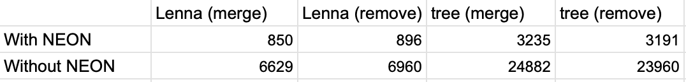

### Теоретическая база 

Оптимизация алгоритмов компьютерного зрения на процессорных системах ARM с использованием NEON включает векторизацию, что позволяет значительно увеличить производительность. NEON — это SIMD (Single Instruction, Multiple Data) движок, который является частью архитектуры ARM и предназначен для выполнения параллельных вычислений. Он работает с 128-битными регистрами, позволяя одновременно обрабатывать несколько данных. Например, один регистр может содержать четыре 32-битных целых числа, и одна команда может выполнять операции над всеми этими числами одновременно. Это значительно снижает количество необходимых инструкций и ускоряет обработку данных, что особенно полезно в задачах, требующих интенсивной математической обработки, таких как фильтрация изображений и обработка видео.

Применение NEON позволяет эффективно обрабатывать изображения и выполнять математические операции параллельно. Это достигается за счет использования специализированных векторных инструкций, которые оптимизированы для архитектуры ARM. В отличие от других архитектур, таких как x86 с SSE/AVX, NEON специально разработан для мобильных и встроенных систем, что делает его идеальным для приложений с ограниченными ресурсами. Используя NEON, разработчики могут значительно повысить производительность своих алгоритмов компьютерного зрения, применяя векторные операции для обработки массивов данных и выполнения сложных вычислений за меньшее время.

### Описание разработанной системы (алгоритмы, принципы работы, архитектура) 

Первый код выполняет операции сложения и вычитания изображений без использования SIMD-инструкций, что делает его простым и понятным. Он использует обычные циклы для обработки каждого пикселя по отдельности, что может привести к более медленному выполнению при работе с большими изображениями из-за последовательной обработки. Тем не менее, этот код легко читается и поддерживается, что делает его подходящим для простых задач.

Второй код использует NEON для выполнения операций сложения и вычитания изображений. Он оптимизирован для обработки нескольких пикселей одновременно, что значительно увеличивает производительность при работе с большими изображениями. Однако код становится более сложным и требует понимания работы с векторными регистрами и SIMD-инструкциями. Это может потребовать больше времени на реализацию и отладку, но в итоге обеспечивает значительное ускорение выполнения.

### Результаты работы и тестирования системы (скриншоты, изображения, графики, закономерности) 

Оценить следующие характеристики:
2.1. Зависимость производительности при изменении размера
входных данных (размера изображения).

# Without NEON:
Lenna + Lenna_gs
Merge: 6629 microseconds
Remove: 6960 microseconds

tree + tree_gs
Merge: 24882 microseconds
Remove: 23960 microseconds

# With NEON:
Lenna + Lenna_gs
Merge: 850 microseconds
Remove: 896 microseconds

tree + tree_gs
Merge: 3235 microseconds
Remove: 3191 microseconds

# 2.2. Зависимость производительности от уровня оптимизации (флаги -O0, -O1, -O2, -O3) для варианта без векторных инструкций.

Lenna + Lenna_gs:
Optimization O0:
Merge: 6681 microseconds
Remove: 7157 microseconds

Optimization O1:
Merge: 1011 microseconds
Remove: 1002 microseconds

Optimization O2:
Merge: 1040 microseconds
Remove: 985 microseconds

Optimization O3:
Merge: 1035 microseconds
Remove: 971 microseconds

# 2.3. Влияние ручной векторизации алгоритма на производительность. 

Ручная векторизация алгоритмов может значительно повысить производительность программного обеспечения, особенно в вычислительных задачах, таких как обработка изображений и матричные операции. Используя SIMD (Single Instruction, Multiple Data) инструкции, векторизация позволяет обрабатывать несколько данных одновременно, что уменьшает количество операций и время выполнения. Это приводит к ускорению работы приложений, так как векторные инструкции могут обрабатывать множество элементов за один такт, что делает их особенно эффективными для высокопроизводительных вычислений.

### Вывод:
Сравнение двух подходов — без использования NEON и с его применением — показывает значительное преимущество в производительности при использовании векторизации. Код без NEON обрабатывает пиксели последовательно, что может привести к замедлению при больших объемах данных. В то время как код с NEON использует параллельную обработку, что значительно сокращает время выполнения операций. Однако ручная векторизация требует более глубокого понимания архитектуры и может усложнить процесс разработки. В итоге, применение NEON становится оправданным решением для повышения эффективности алгоритмов компьютерного зрения на ARM-архитектуре.

## DOCS:

https://cyberleninka.ru/article/n/vektorizatsiya-programmnogo-koda-soderzhaschego-maloveroyatnye-regiony-v-zadachah-vychislitelnoy-geometrii
